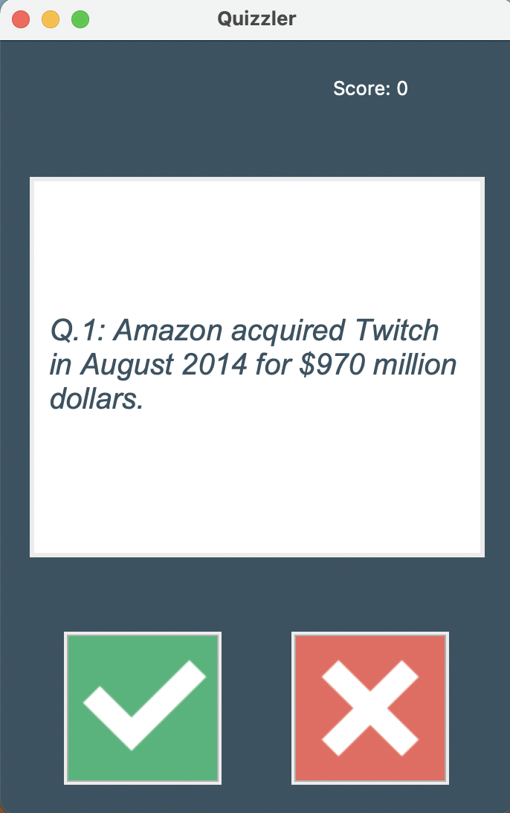
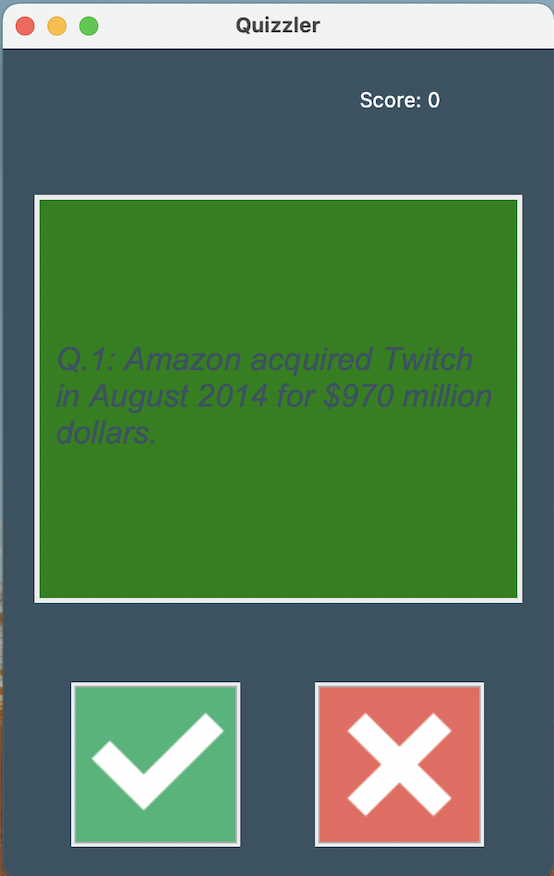
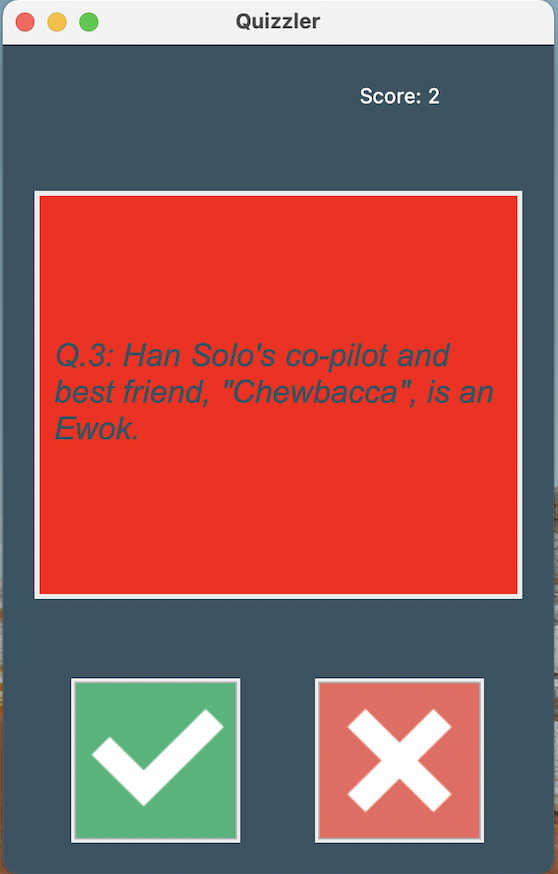

# quizzler-app

This quizzler app is part of the 100 Days of Code - The Complete Python Pro Bootcamp.

This topy project get trivia quizzes from opentdb api, and record the score of user's correct guesses.

## GUI Demo
The question looks like this:

  
  
If the user guessed correct, there is a green background, else, there is a red background.

  
  

## Instructions
Click on the button to guess your answer.
